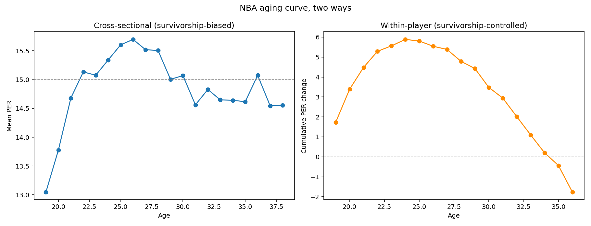
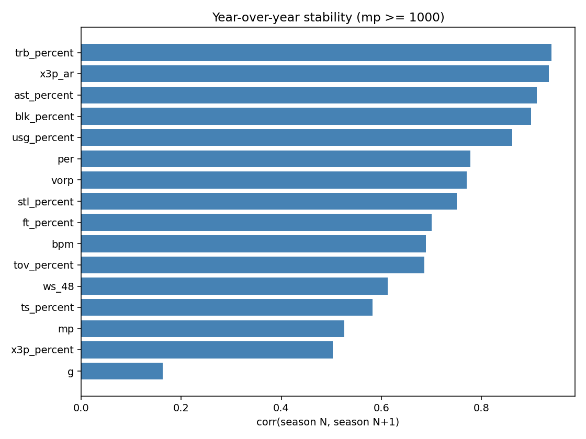
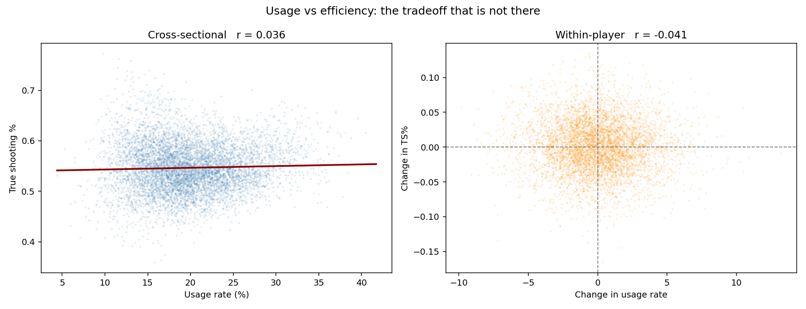
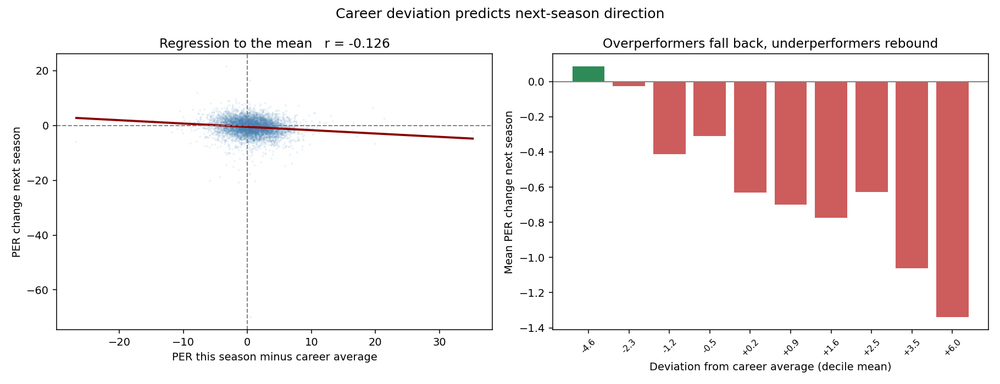
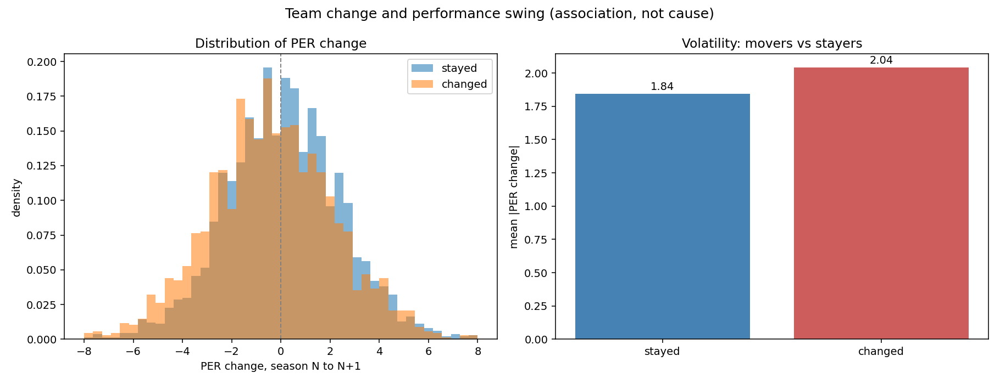
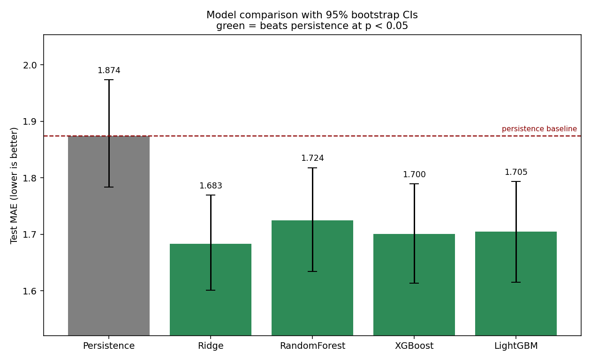
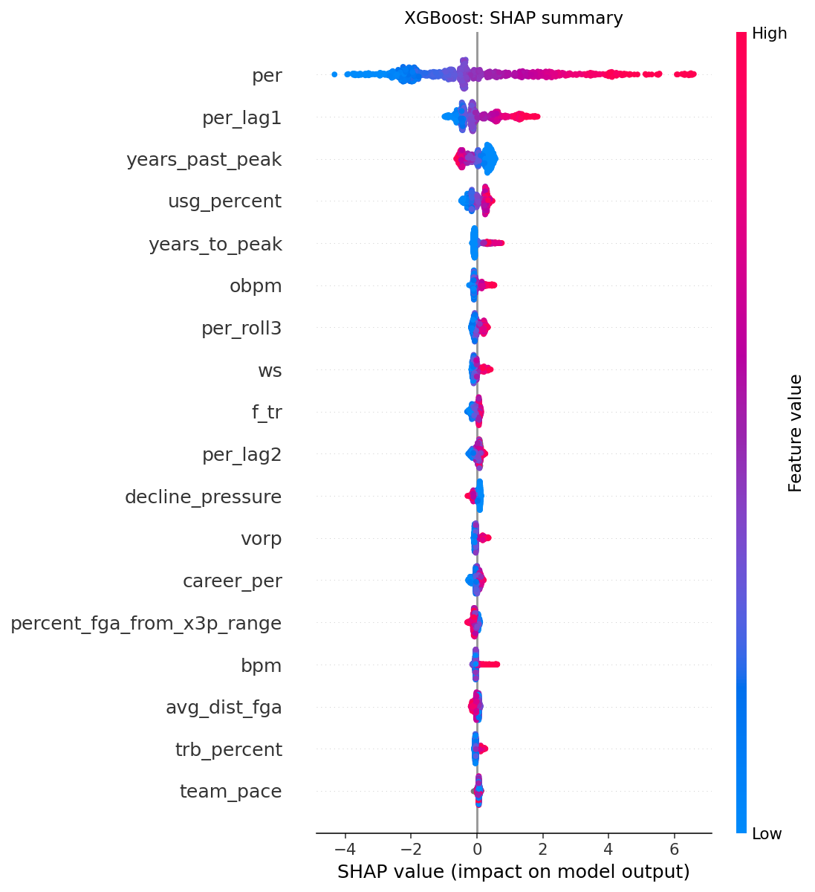
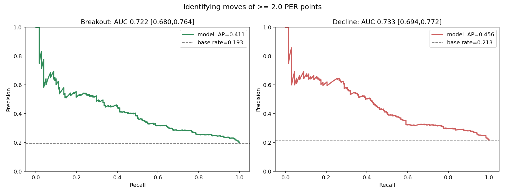
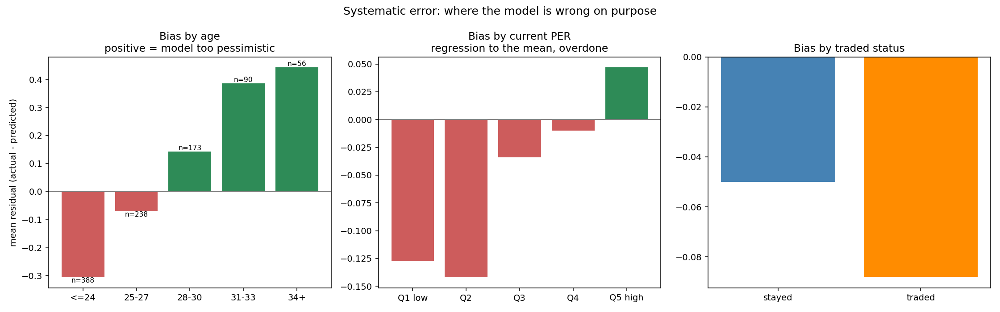
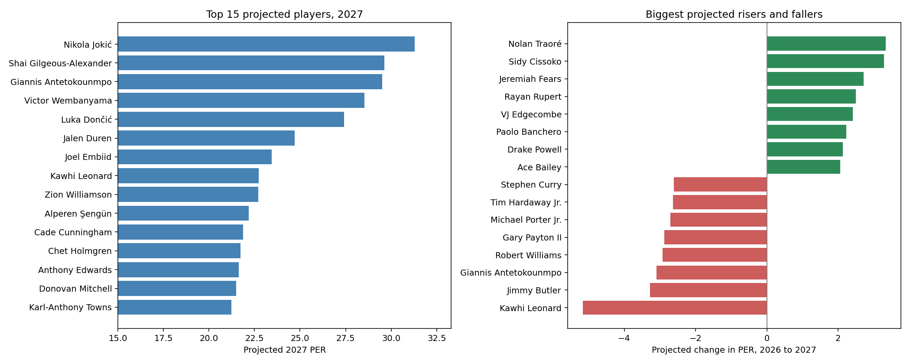

# NBA Player Performance Forecasting

Predicting a player's next-season efficiency from his current and prior seasons, using 30 years of NBA data (1997–2026).

**Headline result: the model reduces mean absolute error by 10.2% against a persistence baseline (1.874 → 1.683 PER), significant at p < 0.05 by paired bootstrap.**

That framing matters. Player performance is heavily autocorrelated, so "next season equals this season" is already a strong predictor. Reporting raw accuracy without that comparison would be meaningless.

---

## Contents

- [Why the baseline is the whole story](#why-the-baseline-is-the-whole-story)
- [Findings](#findings)
- [Modeling results](#modeling-results)
- [Breakout detection](#breakout-detection)
- [Where the model is wrong](#where-the-model-is-wrong)
- [2027 projections](#2027-projections)
- [Methodology](#methodology)
- [Dashboard](#dashboard)
- [Running it](#running-it)
- [Limitations](#limitations)

---

## Why the baseline is the whole story

Before training anything, I measured how well the dumbest possible model performs: predict that next season's PER equals this season's.

It gets MAE **1.874** with R² **0.708**.

Any model that doesn't clearly beat that has accomplished nothing, regardless of how impressive its absolute numbers look. Every result in this project is reported as a difference from that baseline, with a confidence interval.

---

## Findings

### Players peak at 24, not 26



Two ways of measuring the aging curve give different answers, and the gap is the finding.

| Method | Peak age |
|---|---|
| Cross-sectional (mean PER by age) | 26 |
| Within-player (same player, year over year) | **24** |

The cross-sectional curve stays flat into the late thirties and even bumps upward at 36. That bump is survivorship bias, not longevity: the only 36-year-olds still logging 1,000+ minutes are stars. Everyone else is already out of the league and out of the sample.

Comparing each player to himself removes that. On that measure, improvement stops at 24 and **every subsequent age has a negative average change**. Age 36 is the steepest single-year drop at −1.33 PER.

### What a player does is more predictable than how well he does it



Year-over-year correlation for each stat, on players with 1,000+ minutes in both seasons:

| Tier | Stats | Correlation |
|---|---|---|
| Role | rebound rate, 3PA rate, assist rate, block rate, usage | 0.86 – 0.94 |
| Skill | PER, VORP, steal rate, FT%, BPM, turnover rate | 0.69 – 0.78 |
| Efficiency | WS/48, TS%, 3P% | 0.50 – 0.61 |
| Availability | **games played** | **0.16** |

Two consequences:

**3P% at 0.50 is close to a coin flip.** Any model leaning on last season's three-point percentage is fitting noise. This is why "he shot 42% from three, he'll do it again" is usually wrong.

**Games played at 0.16 is the ceiling on this entire problem.** Injuries are essentially unpredictable from prior-season data, and they dominate season outcomes. No amount of feature engineering fixes that.

### The usage–efficiency tradeoff doesn't show up



Conventional wisdom says a player's efficiency drops as his usage rises. In this data it doesn't.

- Cross-sectional correlation: **+0.036**
- Within-player (same player, usage change vs efficiency change): **−0.041**

Both are effectively zero. The only position with a real relationship is point guard at **+0.27**, where higher usage is associated with *better* efficiency.

Honest caveat: usage is allocated by coaches who already know who can handle it, so this is an equilibrium result. It shows no tradeoff at observed usage levels, not that any player could absorb 35% usage without cost.

### Overperformers give it back



Measuring how far a season sits from that player's own career average (excluding the season itself) predicts which direction he moves next year.

| Deviation from career average | Mean next-season change |
|---|---|
| −3.5 (big underperformance) | **+0.03** |
| −0.9 | −0.36 |
| +0.6 | −0.67 |
| +2.0 | −0.70 |
| +4.8 (career year) | **−1.20** |

Cleanly monotonic. A player 4.8 PER above his own norm gives back 1.2 the following season. The persistence baseline cannot see this, because it treats a career year and a typical year identically.

### Traded players swing more, but selection explains part of it



| | n | Mean ΔPER | Mean \|ΔPER\| | Mean age | Mean PER |
|---|---|---|---|---|---|
| Stayed | 3,674 | +0.10 | 1.84 | 25.9 | 16.2 |
| Changed team | 1,881 | **−0.38** | **2.04** | 27.5 | 14.8 |

Movers decline on average while stayers slightly improve. But movers are also 1.6 years older and 1.4 PER worse *before* the move. Teams trade declining players.

The effect survives matching on prior performance (within every tercile, movers swing more), so something real is there. It remains an association, not a causal estimate.

---

## Modeling results



Test set is seasons 2022–2025, 945 player-seasons, never touched during training or tuning.

| Model | MAE | 95% CI | RMSE | R² | vs baseline | p < .05 |
|---|---|---|---|---|---|---|
| Persistence baseline | 1.874 | [1.784, 1.973] | 2.422 | 0.708 | — | — |
| **Ridge** | **1.683** | [1.601, 1.769] | 2.146 | 0.771 | **+0.191** | yes |
| XGBoost | 1.700 | [1.613, 1.789] | 2.185 | 0.763 | +0.173 | yes |
| LightGBM | 1.705 | [1.615, 1.793] | 2.193 | 0.761 | +0.171 | yes |
| Random Forest | 1.724 | [1.634, 1.818] | 2.212 | 0.757 | +0.151 | yes |

All four beat persistence, each winning in 100% of 2,000 bootstrap resamples.

**The models are not distinguishable from each other.** Paired bootstrap on the head-to-head differences:

| Comparison | Difference | 95% CI | Verdict |
|---|---|---|---|
| Ridge vs XGBoost | +0.018 | [−0.025, +0.062] | tied |
| Ridge vs LightGBM | +0.022 | [−0.021, +0.065] | tied |
| Ridge vs Random Forest | +0.042 | [−0.009, +0.091] | tied |

Every interval crosses zero. Claiming "Ridge is the best model" off a 0.018 gap on 945 rows would be reading noise. The defensible claim is that all four beat persistence by a similar margin and are equivalent to each other.

That a plain linear model matches gradient boosting is itself informative: the signal here is largely linear, without rich interactions for trees to exploit.

Ridge also calls the **direction** of change correctly 63.5% of the time, against 50% for a coin flip.

### What the model uses



| Rank | Feature | Mean \|SHAP\| |
|---|---|---|
| 1 | Current PER | 1.790 |
| 2 | PER, previous season | 0.490 |
| 3 | **Years past peak age** | **0.311** |
| 4 | Usage rate | 0.221 |
| 5 | Years to peak age | 0.142 |

Current PER dominates, as expected. The notable result is that `years_past_peak` — built directly from the aging analysis — ranks third, ahead of usage. The EDA fed the model something it couldn't easily learn on its own.

---

## Breakout detection



Regression buries the interesting cases. A model that shaves 10% off MAE does it by being slightly better on everyone, not by calling the players who jump. Reframing as classification asks the question people actually care about.

A move of ±2.0 PER counts as real.

| Task | Base rate | ROC AUC | 95% CI | Avg precision | Lift |
|---|---|---|---|---|---|
| Breakout (≥ +2 PER) | 0.193 | 0.722 | [0.680, 0.764] | 0.411 | **2.14×** |
| Decline (≤ −2 PER) | 0.213 | 0.733 | [0.694, 0.772] | 0.456 | **2.14×** |

Both intervals sit well clear of 0.5. Among the players flagged most confidently, breakouts occur at roughly twice the league rate.

This framing also sidesteps the baseline problem entirely: persistence predicts zero change for everyone, so it flags nothing and has no direction to be right about.

Seven of the ten highest-confidence breakout calls hit, including Scottie Barnes 2023 (15.5 → 19.5) and Walker Kessler 2024 (18.0 → 20.0).

---

## Where the model is wrong



I predicted early on that dropping players who leave the league would make the model *optimistic* about declining veterans. Measuring it showed the opposite.

| Age | n | Mean residual |
|---|---|---|
| ≤24 | 388 | **−0.306** |
| 25–27 | 238 | −0.071 |
| 28–30 | 173 | +0.142 |
| 31–33 | 90 | +0.386 |
| 34+ | 56 | **+0.443** |

Positive residual means the actual outcome beat the prediction. So the model is too **pessimistic** about older players and too **optimistic** about young ones.

The aging features overcorrect. Veterans who survive the minutes filter are the ones who aged well, and the model penalizes them for being 34 regardless. Young players get credited with improvement curves that not all of them deliver.

The largest individual misses are injury and situation stories, exactly what the 0.16 games-played stability predicts: Kawhi Leonard 2025 (predicted 19.8, actual 27.9), Joel Embiid 2024 (predicted 31.1, actual 23.4).

---

## 2027 projections



Refit on all data through 2025 and applied to the 2026 season, for 279 players with 1,000+ minutes.

| Player | Team | Age | 2026 PER | Projected 2027 |
|---|---|---|---|---|
| Nikola Jokić | DEN | 30 | 32.3 | 31.3 |
| Shai Gilgeous-Alexander | OKC | 27 | 30.8 | 29.6 |
| Giannis Antetokounmpo | MIL | 31 | 32.6 | 29.5 |
| Victor Wembanyama | SAS | 22 | 29.9 | 28.5 |
| Luka Dončić | LAL | 26 | 27.9 | 27.4 |

**Read these with the bias above in mind.** Given that the model runs pessimistic on older players, the projected declines for veterans are probably overstated — Kawhi Leonard at −5.2 especially. Full output in [`data/processed/projections_2027.csv`](data/processed/projections_2027.csv).

---

## Methodology

### Data

Basketball-Reference data via [Kaggle: NBA Stats (1947–present)](https://www.kaggle.com/datasets/sumitrodatta/nba-aba-baa-stats). Ten source files joined on `season` + `player_id`.

Scope is 1997 onward, since shooting and play-by-play data don't exist before that. ABA and BAA seasons excluded.

### Decisions that shaped the result

**Traded players produce duplicate rows.** A player dealt mid-season appears as a `2TM` aggregate *plus* one row per team. Ochai Agbaji's 2026 season is three rows. Keeping all of them would train on the same player-season repeatedly with conflicting values. Keeping the aggregate and dropping the splits took 31,119 rows to 25,319.

**Minutes filter on season N only.** Requiring 1,000+ minutes in the *predictor* season cuts attrition from 19.4% to 3.9%. Applying the same filter to the target season would condition on the outcome, which is a worse bug than the survivorship it fixes.

**Players absent the following season are dropped**, and the residual bias is documented rather than hidden. Remaining attrition is 3.9%, concentrated among age 33+ (11%) and bottom-quartile performers (7.3%).

**Target reliability floor.** PER is a rate stat; at three minutes played it is noise with a number attached. Nenê's 2006 season was one game and produced PER −54.4. Rows whose *target* season is under 500 minutes are excluded from the primary analysis. Those 202 rows carried MAE 6.16 against 1.91 for the rest. The unfiltered result is reported as a sensitivity check: persistence 2.025, Ridge 1.868, improvement +0.157. The conclusion holds either way.

**Team context comes from season N only.** Using the following season's team pace would mean the model knows about trades before they happen.

**The `hof` column is excluded** from the feature set. It depends on a player's entire future career.

### Splits

Time-based, never random: train ≤ 2018 (4,871 rows), validate 2019–2021 (688), test 2022+ (945). A random split would let the model see 2024 while predicting 2023, and would put the same player on both sides.

### Feature engineering

107 features from 89 raw columns:

- **Career context** — expanding mean of prior seasons, shifted so the current season is never included in its own average, plus deviation from it and distance below career best
- **Age** — encoded as distance past the empirical peak of 24, with a nonlinear decline term
- **Trend** — two-season slope, consecutive improvement and decline flags, minutes trend
- **Role** — usage shift, starter share, minutes per game
- **Lags** — 1 and 2 season lags, deltas, and 3-season rolling means for eight core stats

Five columns were dropped as redundant, three of them exact duplicates created during earlier phases (`g_share` was `g/82`; `percent_fga_from_x3p_range` was `x3p_ar` renamed). Raw `age` and `age²` were also dropped once `years_past_peak` made them redundant at r = 0.983.

### Leakage guard

An automated check asserts that no feature correlates with the target more strongly than current-season PER does (0.777). Nothing legitimate should predict next season better than this season's own value. If a future feature ever smuggles in the future, the build fails.

The career-average calculation was verified by hand: LeBron James's 2025 `career_per` matches a manual mean of every season through 2024, exactly, and excludes 2025.

---

## Dashboard

An 11-table star schema is exported to `tableau/` — three dimensions, six facts, two reference tables, with referential integrity asserted at build time.

Design notes:

- Predictions are stored **long**, one row per player × season × model, so a single filter switches an entire dashboard between models.
- Categoricals (`tier`, `direction`, `age_group`) are pre-binned, since binning in a BI tool is error-prone.
- `direction_correct` is **null** for the persistence baseline, not zero. Persistence predicts no change, so direction is undefined; scoring it zero would misrepresent the baseline.

Setup instructions, calculated fields, and a five-page layout plan are in [`tableau/SETUP_GUIDE.md`](tableau/SETUP_GUIDE.md).

---

## Running it

```bash
git clone <this-repo>
cd NBA-Player
pip install -r requirements.txt

# download the dataset from Kaggle and unzip into data/raw/
# https://www.kaggle.com/datasets/sumitrodatta/nba-aba-baa-stats

python src/run_all.py
```

Rebuilds everything — base table, features, models, plots, Tableau export — in one command.

Individual phases:

```bash
python src/build_base.py            # Phase 0: clean and join
python src/build_model_table.py     # Phase 1: pair N with N+1, set baseline
python src/eda_aging_stability.py   # Phase 2: aging curves, stability
python src/eda_phase2b.py           # Phase 2: usage, team change, extremes
python src/build_features.py        # Phase 3: feature engineering + audit
python src/train_models.py          # Phase 4: modeling
python src/phase5_analysis.py       # Phase 5: classification, projections
python src/export_bi.py             # Phase 6: Tableau export

python src/check_eda.py             # 28 validation checks on Phase 2
```

### Structure

```
├── src/                    pipeline, one script per phase
│   ├── paths.py            single source of truth for paths
│   └── run_all.py          rebuild everything
├── data/
│   ├── raw/                Kaggle CSVs (gitignored)
│   └── processed/          generated tables
├── plots/                  19 figures
└── tableau/                star schema + setup guide
```

---

## Limitations

**Injuries set the ceiling.** Games played correlates 0.16 year over year. The largest prediction errors are all availability stories, and no feature in this dataset anticipates them.

**Attrition bias remains.** Players who leave the league are excluded. At the 1,000-minute threshold that is 3.9% of rows, concentrated among older and weaker players.

**The model is biased by age**, too pessimistic about veterans and too optimistic about young players. This is measured and reported above rather than corrected, since correcting it post hoc on the test set would be fitting to the evaluation data.

**PER is one definition of performance** and it is offense-weighted. A defense-first player is systematically undervalued by this target.

**No contract, coaching, or role-change information.** A player moving into a starting role or a new system can shift substantially for reasons invisible in prior-season box score data.

**Team context is from the predictor season.** For a player who changes teams, the model uses his old team's pace and rating, since the new team is unknown at prediction time.

---

## Data source

[NBA Stats (1947–present)](https://www.kaggle.com/datasets/sumitrodatta/nba-aba-baa-stats) on Kaggle, sourced from Basketball-Reference. Not redistributed here; download it directly.
